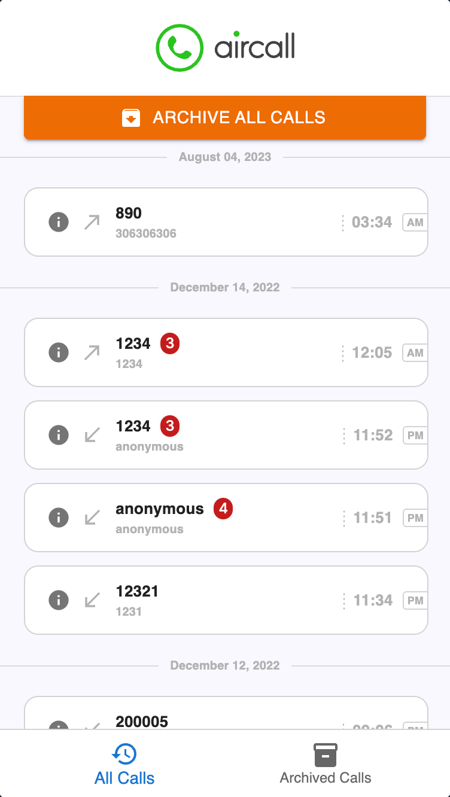

# ReactJS Activity Feed App

## Repository

I have completed the assignment and submitted the code to the following public GitHub repository: [GitHub Repository](https://github.com/jsingh0026/aircall)

## Deployment

The live version of the app is deployed on [Vercel](https://aircall-gules.vercel.app).

## Changes Made

I made several enhancements to the provided skeleton app to showcase my skills:

- Improved UI/UX design with attention to detail.
- Implemented smooth transitions between pages for a better user experience.
- Followed best practices in React development, including component structure and state management.
- Wrote clean, readable, and maintainable code to ensure long-term scalability.

## Additional Features

In addition to the specified features, I added a few extra functionalities to demonstrate my capabilities:

- Sorting: Calls are sortable based on date and time parameter.
- Swipe Actions: Users can effortlessly archive/unarchive a call by simply swiping left on the call card in the Activity Feed.
- Improved Error Handling: In the event of a failure during the archiving/unarchiving API call, users are immediately provided with a visually appealing toast message.
- Instant Data Retrieval: The app employs a sophisticated caching mechanism to ensure swift and seamless switching between the "All Calls" and "Archived Calls" tabs, resulting in fewer API calls.

## App Preview

Here is a preview of the enhanced app:


## Installation

To set up the project locally, follow these steps:

```
yarn install
yarn start
```

## API Documentation

The app interacts with the provided API.

Thank you for the opportunity to showcase my skills. I look forward to any feedback and further discussions.

Best regards,\
Jaspreet Singh\
jass.singh0026@gmail.com
